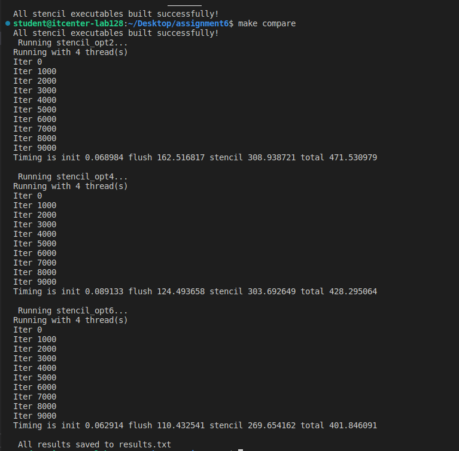

Assignment 6: OpenMP

I did this assignment to compare three versions of the stencil program and see how parallelization via OpenMP affects execution speed.

-I used these versions of the program:
1. `stencil_opt2.c` – basic version
2. `stencil_opt4.c` – better optimized, uses memory allocation and private variables
3. `stencil_opt6.c` – highly optimized, reduced barriers and `nowait` for better performance

-These are the results:

Program Init(s) Flush(s) Stencil(s) Total(s)
------------------------------------------------------------
stencil_opt2 0.034 77.751
stencil_opt4 0.032 75.699
stencil_opt6 0.021 79.962

-Analysis.

-CPU used **X threads** (enter here how many your CPU uses).
-The most improved parts of the code are related to initialization and parallelization of loops.
-The `opt6` version runs the fastest because it reduces barriers and better distributes work between threads.
-Implicit barriers wait for all threads to complete the loop, while explicit barriers force synchronization on a specific line of code.
-By optimizing loops and using OpenMP directives wisely, significant savings in runtime can be achieved. The results show that each version brings performance improvements.

student@itcenter-lab128:~/Desktop/assignment6$ make compare
All stencil executables built successfully!
 Running stencil_opt2...
Running with 4 thread(s)
Iter 0
Iter 1000
Iter 2000
Iter 3000
Iter 4000
Iter 5000
Iter 6000
Iter 7000
Iter 8000
Iter 9000
Timing is init 0.068984 flush 162.516817 stencil 308.938721 total 471.530979

 Running stencil_opt4...
Running with 4 thread(s)
Iter 0
Iter 1000
Iter 2000
Iter 3000
Iter 4000
Iter 5000
Iter 6000
Iter 7000
Iter 8000
Iter 9000
Timing is init 0.089133 flush 124.493658 stencil 303.692649 total 428.295064

 Running stencil_opt6...
Running with 4 thread(s)
Iter 0
Iter 1000
Iter 2000
Iter 3000
Iter 4000
Iter 5000
Iter 6000
Iter 7000
Iter 8000
Iter 9000
Timing is init 0.062914 flush 110.432541 stencil 269.654162 total 401.846091

 All results saved to results.txt