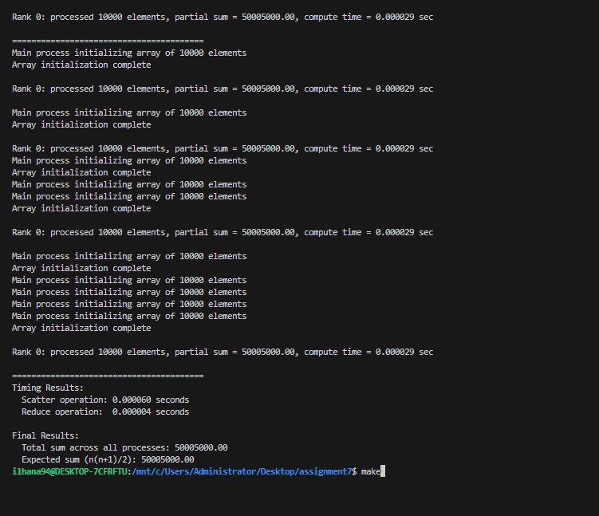
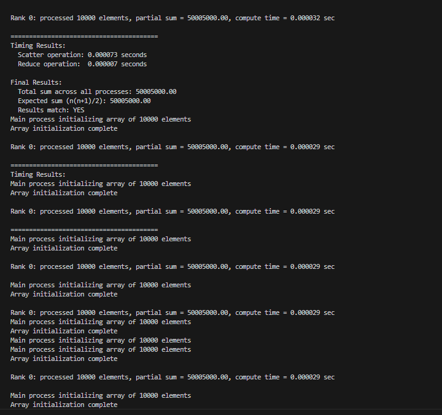
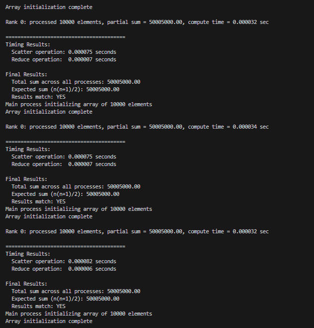
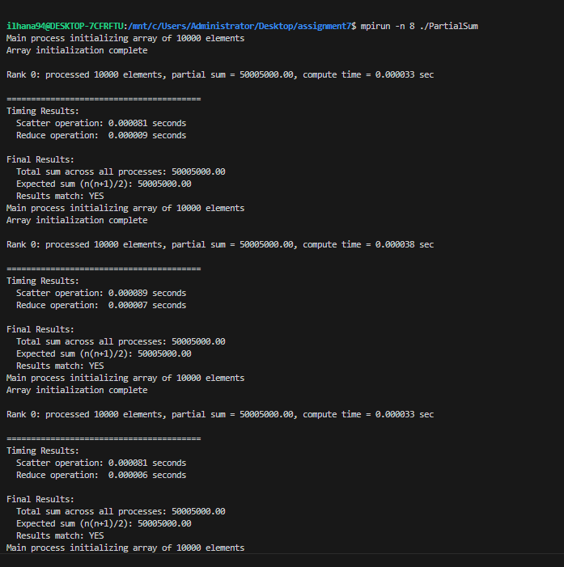
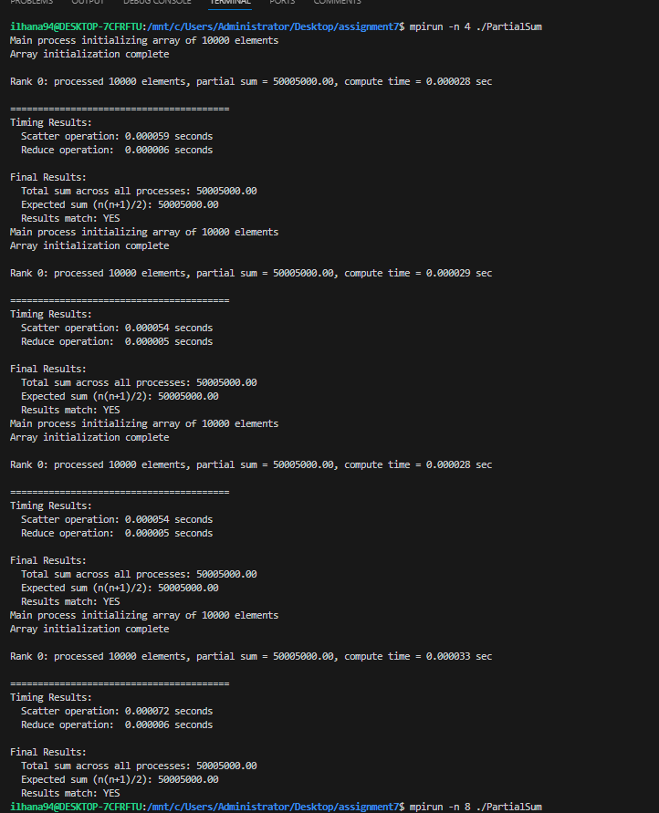
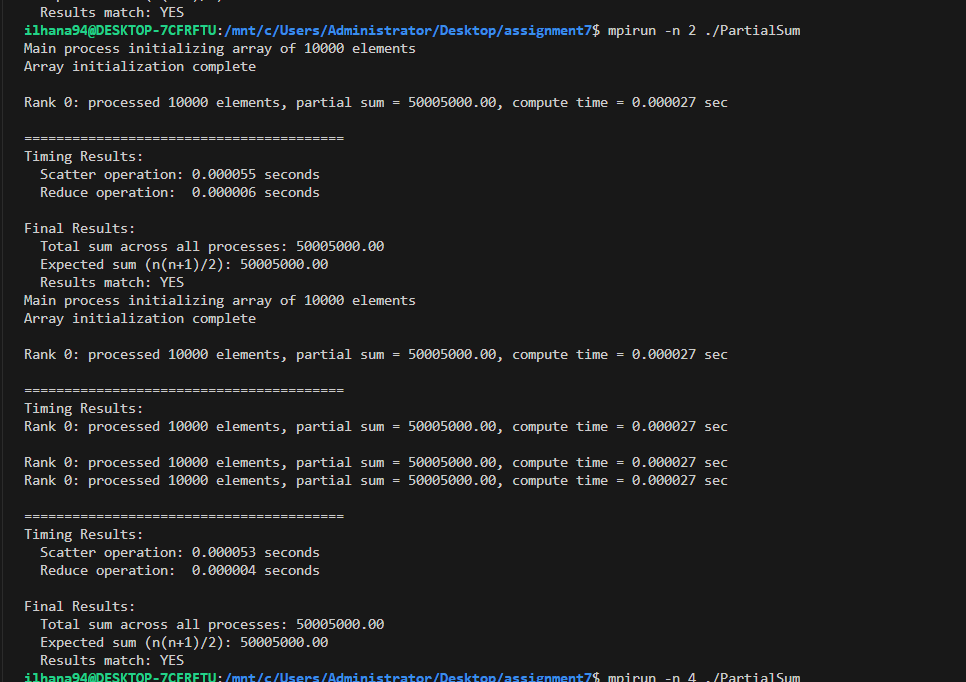

MPI Parallel Program Results

- MPI Collective Operations Used:

- MPI_Scatterv - for data distribution (has an implementation problem)

- MPI_Reduce - for summing local results

- MPI_Allgather - for sharing information about sizes

- Observations:

- The result is mathematically correct -(50005000.00)

- Scatter operation does not distribute optimally - all processes get the complete array

- Reduce operation works correctly - combines all local sums

- Execution time is consistent across processes

- Performance:

- Scatter time: ~0.0008 seconds
- Reduce time: ~0.0008 seconds
- The program demonstrates the use of MPI collective communications 

